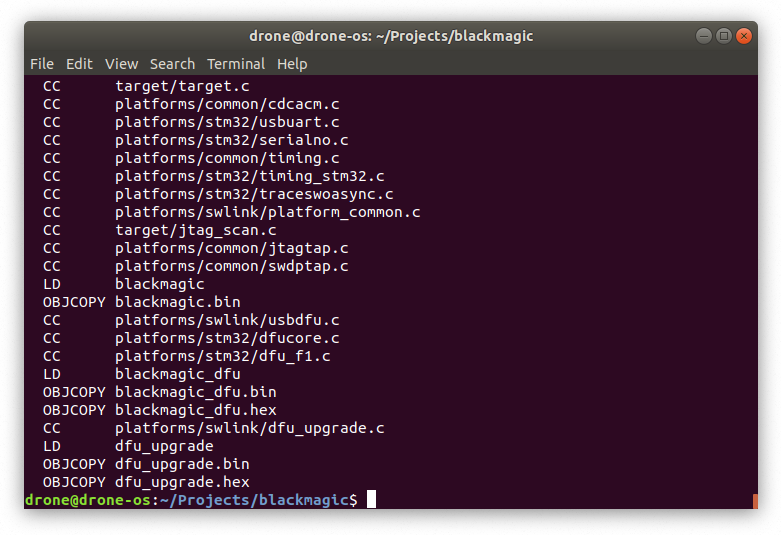
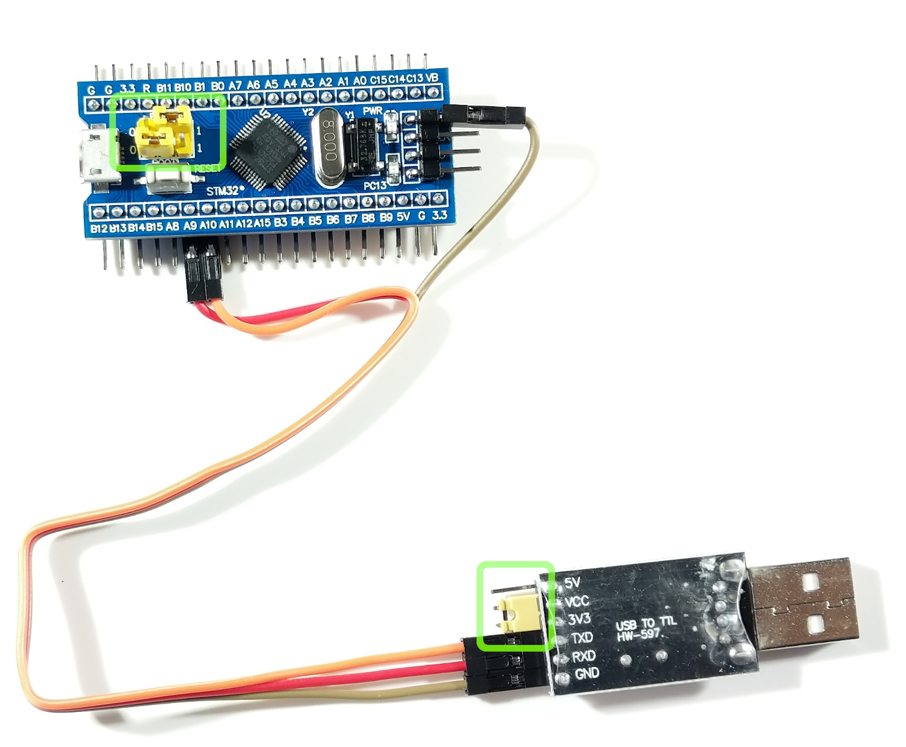
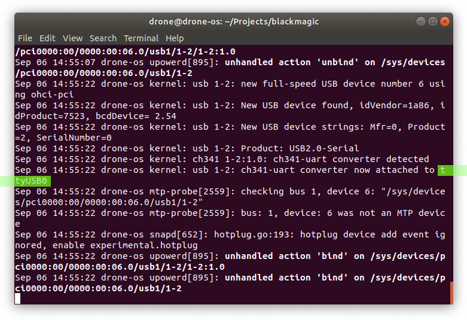
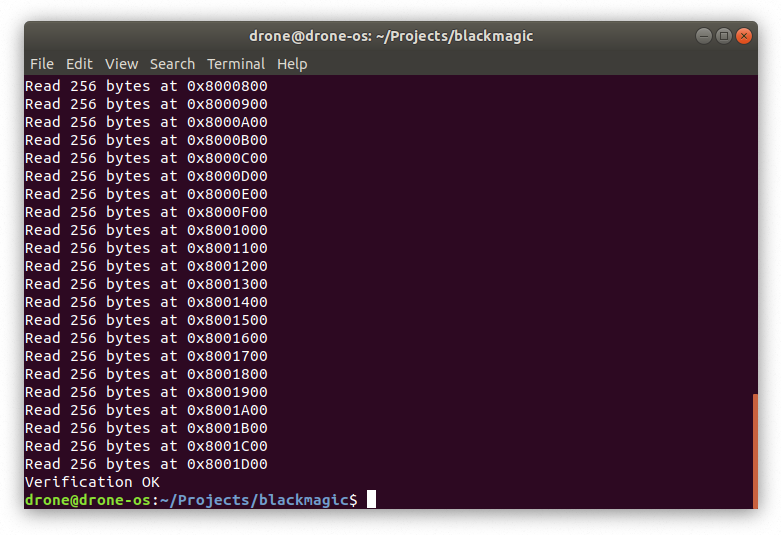
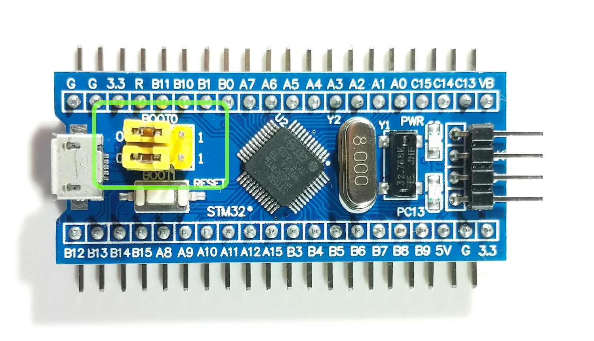
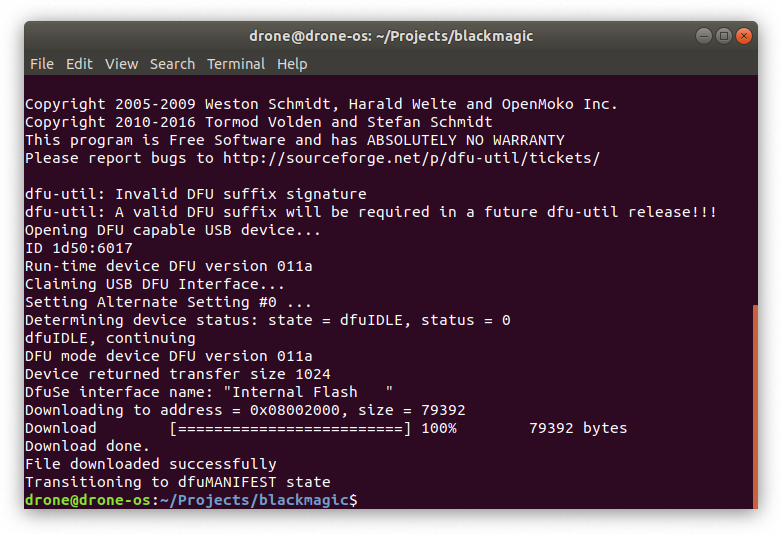
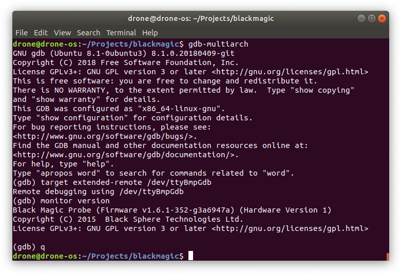
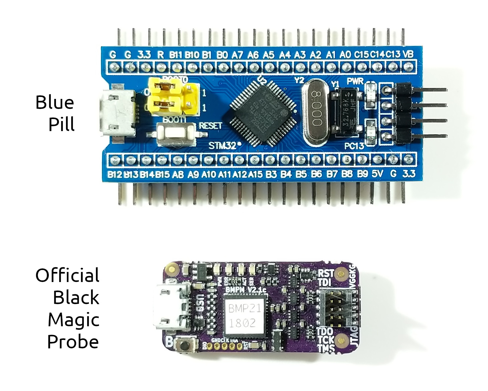

# Black Magic Probe from a Blue Pill

This chapter describes the process of making a Black Magic Probe from a Blue
Pill board. The steps were tested on Ubuntu 18.04.3 LTS and Arch Linux 5.3.7.

## Preparation

The process requires the following packages to be installed:

```shell
$ sudo apt install build-essential \
                   curl \
                   dfu-util \
                   gcc-arm-none-eabi \
                   gdb-multiarch \
                   git \
                   python \
                   python-pip
```

It is convenient to join the `dialout` group. This way you will not need
super-user privileges to work with BMP and USB-to-UART adapter:

```shell
$ sudo adduser $(id -un) dialout
```

or the `uucp` group on Arch Linux:

```shell
$ sudo gpasswd -a $(id -un) uucp
```

In order for the group change to take effect, you will need to re-login.

Get the stm32loader script and install its python dependencies:

```shell
$ git clone https://github.com/jsnyder/stm32loader
$ pip install pyserial
```

Get the BMP firmware:

```shell
$ git clone https://github.com/blacksphere/blackmagic
$ cd blackmagic
$ git submodule update --init --recursive
```

BMP repository provides udev rules for the probe. The rules instruct udev to
symlink the GDB endpoint to `/dev/ttyBmpGdb` and the UART to
`/dev/ttyBmpTarg`. Also they allow to upgrade BMP firmware without super-user
permissions.

```shell
$ sudo cp driver/99-blackmagic.rules /etc/udev/rules.d/
$ sudo udevadm control --reload-rules
```

## Building

Correct probe host should be selected. In our case it's `swlink`.

```shell
$ make PROBE_HOST=swlink
```



This will produce two binaries we are interested in: `src/blackmagic_dfu.bin`
and `src/blackmagic.bin`. The first is a bootloader, which will be flashed with
the USB-to-UART adapter. And the second is the actual firmware, which will be
loaded through USB with help of the bootloader.

## Flashing Bootloader

1. Connect the USB-to-UART adapter with the Blue Pill according to this table:

   | USB-to-UART | Blue Pill |
   |-------------|-----------|
   | GND         | GND       |
   | RXD         | A9        |
   | TXD         | A10       |

2. Set the jumper on the USB-to-UART adapter to the position where VCC and 3V3
   are shorted. This will set the adapter's output voltage to 3.3 v. Although it
   is not strictly needed, because A9 and A10 pins are five-volt-tolerant.

3. Set BOOT0 jumper on the Blue Pill to 1 to boot into the factory programmed
   bootloader. The bootloader is responsible for programming the board through
   UART.



4. Before connecting the USB-to-UART adapter to your PC, open the system
   journal:

   ```shell
   $ journalctl -f
   ```

   Connect the USB-to-UART adapter and notice the name it is assigned:



5. Connect a USB-cable to the Blue Pill and start the flashing process. Replace
   `/dev/ttyUSB0` with your value from the previous step. If the process is not
   starting, press the reset button on the Blue Pill.

   ```shell
   $ ../stm32loader/stm32loader.py -p /dev/ttyUSB0 -e -w -v src/blackmagic_dfu.bin
   ```



6. Set BOOT0 jumper on the Blue Pill back to 0.



## Flashing Firmware

Now you can disconnect the USB-to-UART adapter from the Blue Pill and your
PC. The firmware will be flashed through USB port:

```shell
$ dfu-util -d 1d50:6018,:6017 -s 0x08002000:leave -D src/blackmagic.bin
```



Now we will check that it works. Reconnect the Blue Pill and open a GDB session:

```shell
$ gdb-multiarch
```

At the GDB prompt enter the following commands:

```text
target extended-remote /dev/ttyBmpGdb
monitor version
```



If your output is similar to the output above, congratulations! Now your Blue
Pill is a Black Magic Probe! Next time you need to upgrade the firmware you only
need to repeat the `dfu-util` command above.

## Wiring

Here is a general pin-out description and an example connection with a Blue
Pill:

| Black Magic Probe | Function            | Blue Pill Target |
|-------------------|---------------------|------------------|
| GND               | GND                 | GND              |
| SWCLK             | JTCK/SWCLK          | SWCLK            |
| SWIO              | JTMS/SWDIO          | SWIO             |
| A15               | JTDI                |                  |
| B3                | JTDO                |                  |
| B4                | JNTRST              | R                |
| B6                | UART1 TX            |                  |
| B7                | UART1 RX            | B3               |
| A3                | UART2 RX (TRACESWO) |                  |


## Comparison with Official BMP



There are a few advantages of the official BMP:

- Has a Cortex Debug connector
- Can power the target
- Can sense the target's voltage
- Has more LEDs
- Has more robust circuitry

These advantages are not critical, however by buying the official hardware you
are supporting the BMP project.
