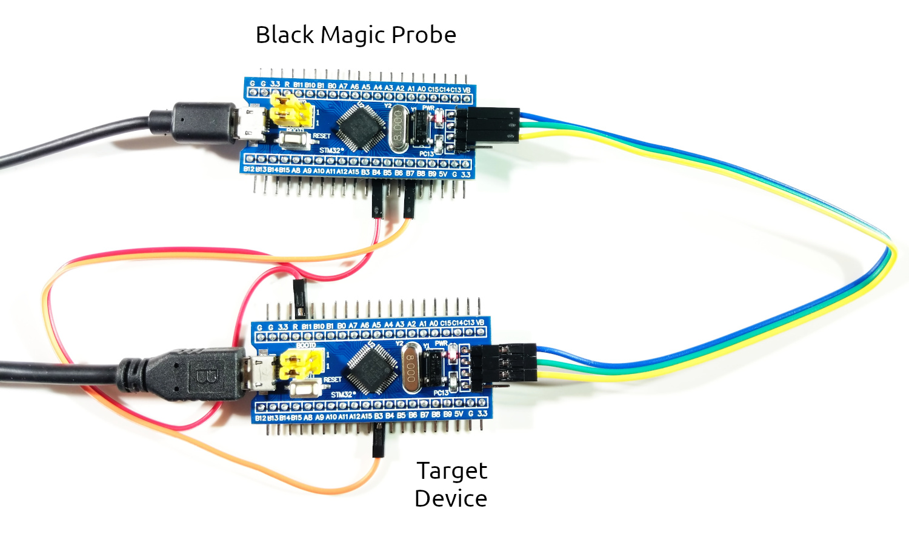
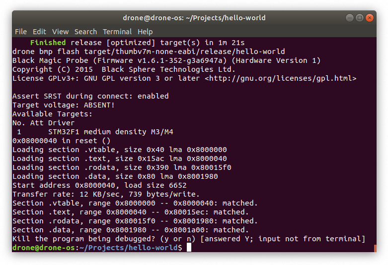
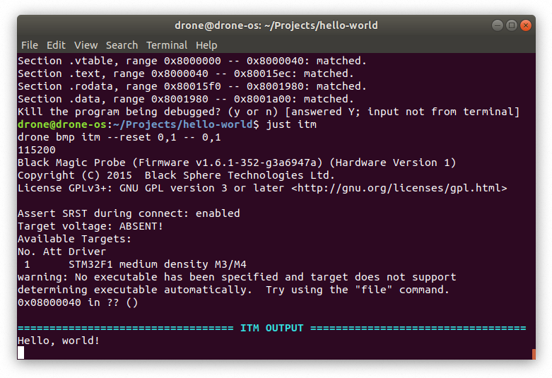

# Hello, world!

In the previous chapter we created a debug probe from a Blue Pill, and attached
it to another Blue Pill board. In this chapter we will run our first Drone
program on the microcontroller.

## Rust

If you haven't installed Rust yet, follow the instructions from
[rustup.rs](https://rustup.rs/). Drone is currently available only for Nightly
channel of Rust. You need to install it first:

```shell
$ rustup toolchain install nightly
```

## `just` command

In embedded development often there are various project-specific tasks that are
needed to run from time to time. Therefore we encourage using an excellent Rust
crate [`just`](https://github.com/casey/just):

```shell
$ cargo +stable install just
```

Just is a command runner inspired by `make`. Whenever you see a project with
`Justfile` at the root, run `just --list` to see all available
commands. Furthermore `drone new` command will generate a `Justfile` for you. It
is advisable to put `alias j="just"` to your shell config, so you could just
type `j` instead of `just`.

## `drone` command

The Drone OS project consists of many Rust crates. However there is a single
entry point for it - the `drone` command-line utility:

```shell
$ cargo +nightly install drone
```

For now you should have all prerequisites and could follow to the next step -
generating your first Drone crate.

## New project

Let's tell `drone` to generate a new Drone crate for us. We have to specify the
target MCU family, which is `stm32f103` for Blue Pill, the flash memory size,
the RAM size, and the project name.

```shell
$ drone new --device stm32f103 --flash-size 128K --ram-size 20K hello-world
$ cd hello-world
```

The first thing to do inside the project is to install dependencies:

```shell
$ just deps
```

You should also run this task after each Rust update.

Now we assume you have the Blue Pills connected as follows (as described in the
previous chapter):



Let's flash our newly created project to the target Blue Pill. If it has to be
built first, it could take a while:

```shell
$ just flash
```

A successful result looks like this:



And finally, check the ITM output from the device.

```shell
$ just itm
```



If you see an output like above, congratulations! You have successfully set up
an environment for developing Drone projects.
