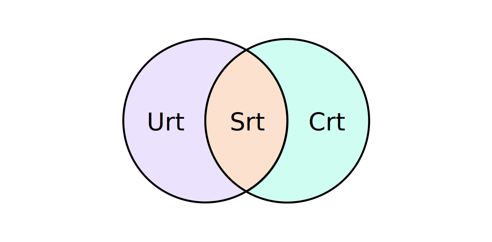

# Memory-Mapped Register Token Tags

Let's take a closer look at what exact type a register token has:

```rust
pub fn handler(reg: Regs) {
    let rcc_cr: reg::rcc::Cr<Srt> = reg.rcc_cr;
}
```

A register token tag has one generic parameter - a register tag. There are three
possible register tags:

* `Urt` (for **U**nsynchronized **r**egister **t**ag)
* `Srt` (for **S**ynchronized **r**egister **t**ag)
* `Crt` (for **C**opyable **r**egister **t**ag)

The tags are crucial to eliminate data-races for read-modify-write operations
and to control move-semantics of the tokens.



Here `RegOwned` is a kind of tag that *doesn't* implement the `Copy` trait, and
`RegAtomic` makes all read-modify-write operations atomic.

Operations for register tokens and field tokens without an atomic tag (`Urt`)
require exclusive (`&mut`) borrows. While atomic tokens (`Srt`, `Crt`) require
shared (`&`) borrows. This eliminates any possibility of data-races by
leveraging Rust compile-time checking. Despite `Urt` tagged tokens use more
effective, but non-atomic processor instructions, it is impossible to use
concurrently. A program with a possible data-race will be rejected by the
compiler, and there are no additional checks in the run-time.

For the whole register tokens, the only affected operation in regard to
atomicity is the `modify` method. However for the field tokens, all write
operations incur additional cost if used with an atomic tag. Because field
tokens could be shared between different threads.

Another property of a token is affinity (expressed by the `RegOwned` trait.) An
affine type can't be copied nor cloned, and uses Rust move-semantics. If a token
has an affine tag (`Urt`, `Srt`), it is guaranteed that there exists only one
token for this particular register or field. Though such tokens could still have
multiple shared borrows. Non-affine (`Crt`) tokens can be freely copied, because
they implement the `Copy` trait. Copying of tokens is still zero-cost, because
tokens are zero-sized. On the other hand copyable tokens are always atomic.

To switch between different tags of tokens, both whole register tokens and
register field tokens provide the following three methods:

* `into_unsync()` - converts to unsynchronized token
* `into_sync()` - converts to synchronized token
* `into_copy()` - converts to copyable token

These methods take their tokens by-value, and return a new token of the same
type but with a different tag. Not all conversions are possible. For example if
a token is already `Crt`, there is no path backwards to `Srt` or `Urt`. Because
we can't guarantee that all possible copies of the `Crt` token are dropped. For
the details refer to the `drone_core::reg` documentation. As one might guess,
these conversion methods are completely zero-cost.
